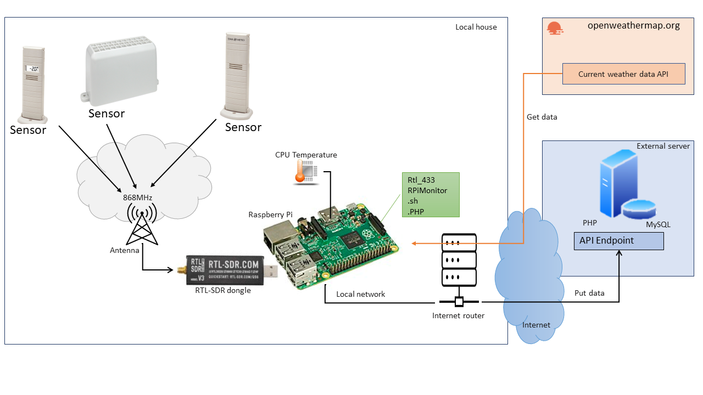
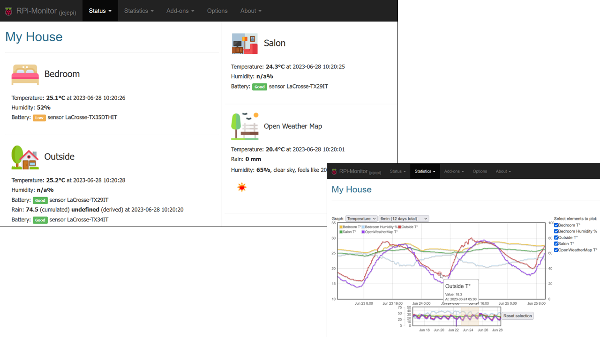

# Palmeteo

## The weather station in your hand

This project give information on how to setup a local weather station, with your own sensors, using a Raspberry Pi.

**Devices**

- A **Raspberry Pi** 3B with Raspbian on it
- a **RTL-SDR USB dongle** (I use the one from https://www.rtl-sdr.com/buy-rtl-sdr-dvb-t-dongles/)
- a set of **weather sensors**. I use La Crosse TX29-IT (temperature), TX35-IT (temperature + humidity), TX34-IT (rainmeter)
- An **optional external web server with PHP and MySQL**, to store data remotlyy and eventually use a cloud-based software to view data
- The Pi is protected by an **internet router** to not expose it to the internet

**Software stack**

- The **rtl_433** (https://triq.org/rtl_433/) software will be use to read data from the sensors via the USB dongle
- **Rpimonitor** (https://xavierberger.github.io/RPi-Monitor-docs/index.html), which is an abandoned project (in june 2023) but still working. It will be used to store (in RRD format) and display graphic in a local website
- Some **utilities, in PHP or shell**, hosted in this repository.
- On the external web server, there are **MySQL DB server and PHP web server** running, and an incomming HTTPS endpoint to receive data and store them remotly.
- Also, to have nice weather graphic, I set up a connection to the **Openweathermap.org site to get current temperature from regional weather station**. It allows me to compare my data with some other public data.

**How it works**

- Sensors (temperature, humidity) broadcasts **data on 868MHz** to any compatible receivers. Normally, because I use La Crosse sensors, the receivers are supposed to be La Crosse weather stations. But because data are sent over the air, any radio receivers able to tune on 868MHz can receive data from the sensors. Note that data are sent every 6 to 10 seconds.
- I use a USB dongle to receive radio data on the Raspberry Pi. Normally, this kind of receivers are used to receive TV broadcasts, but with some special drivers **you can tune to any frequency, especially the 868MHz band**.
- On the Raspberry Pi, I run **rtl_433 program to receive, and decode, the data from the sensors**. The protocol used by the sensors is quite simple, there is no cryptographic encoding. It has been reverse-engeneered several time ( [see my own implementation here](https://github.com/merbanan/rtl_433/commit/a9a574fe4f93b63caef52d0fcecb23afa0a01fc2) ), and the rtl_433 know how to decode a lot of protocols.
- By experience, I know **it is not a good idea to let rtl_433 run for ever** to listen for data from the sensor : the USB dongle will go hot, and it is not very usefull to gather weather data every 10s, and store them also at such frequency.
- So I decided to **gather data for 30s every 20mn**. To do that, I scheduled a cron-job to run a shell script running rtl_433 for 30 seconds only (using the `-T` flag to do so). In 30s, I received 3 or 4 times data from the sensors.
- This shell script also call the [OpenWeatherMAP API](https://openweathermap.org/current) to get the **current region temperature and considere it as an other kind of sensor**.
- Additionnaly, the shell script also get the **Raspberry Pi CPU temperature**.
- Data received are stored locally on the Raspberry Pi, but to not overload the SD card, **I use a RAM drive to store them**. It is not a big deal if the data are lost when the Pi is restarted.
- After the 30s of data gathering, a **script is run to filter data, and store them on the RAM drive in separate files and are sent to the external MySQL server**. The seprates files will allow easy data reading for other process like RPIMonitor.
- RPIMonitor which is a service runnning in background, will read the separate files at regular basis, process them, and **generate RRD files**
- This monitoring tool provide a web interface and some basic features to **present RRD data in a graphic**.

